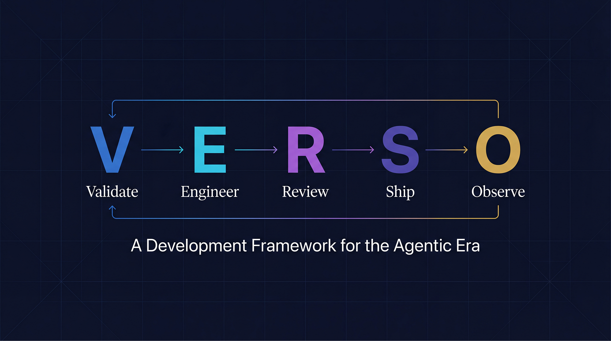
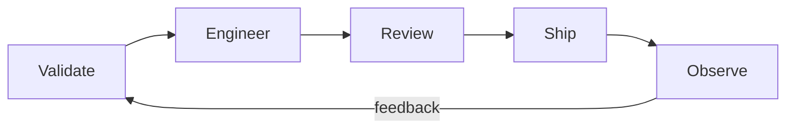
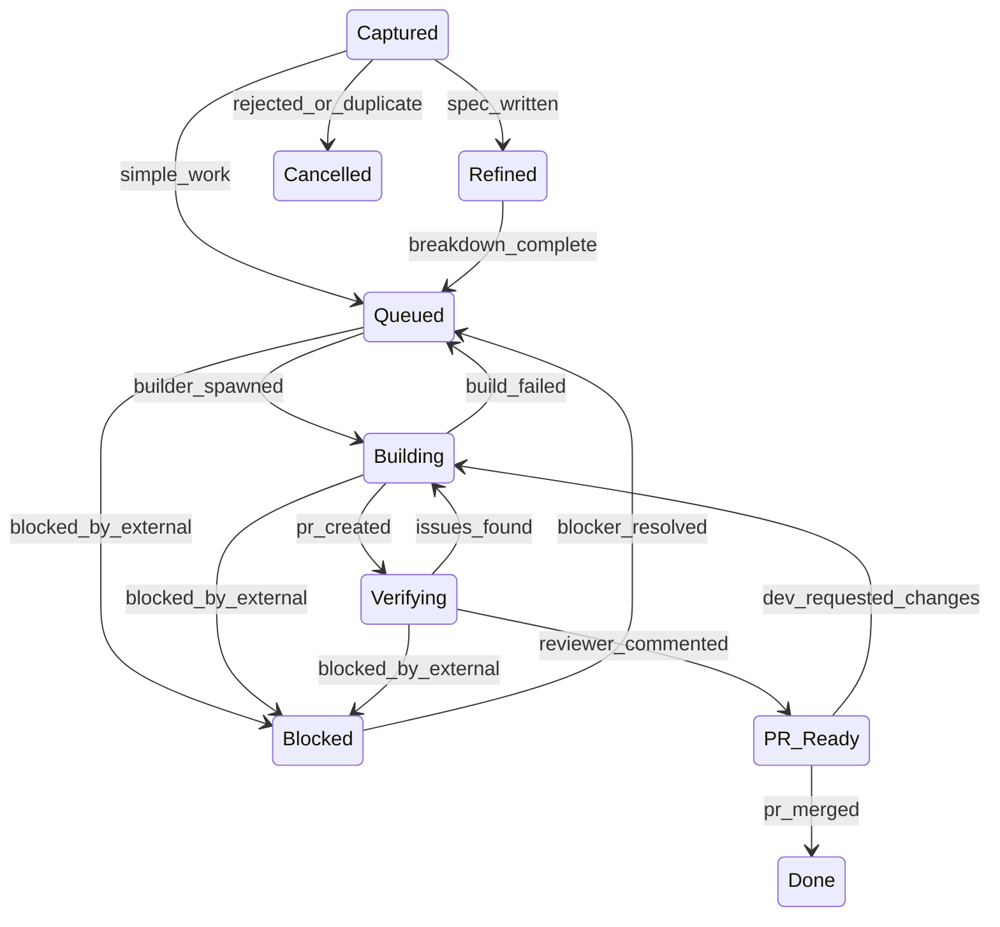

<p align="center">
  <h1 align="center">VERSO</h1>
</p>

<p align="center">
  <strong>Validate · Engineer · Review · Ship · Observe</strong>
</p>

<p align="center">
  The first development methodology designed for developers working with AI coding agents.
</p>

---

Scrum and Kanban were built to coordinate humans writing code. If you are a developer working with AI coding agents, you have none of those problems. You have a new one: **the bottleneck moved from execution to decisions.**

An agent can write a feature in minutes. But it needs someone to decide *what* to build, *approve* the output, and *choose* what comes next. VERSO optimizes for **decision throughput** — maximizing correct decisions per hour of developer time.

## What is VERSO?

VERSO is a development lifecycle framework for developers (solo or teams) working with AI coding agents like Claude Code, Cursor, Copilot, or any tool that writes code for you.

Five macro-phases. Continuous flow. No sprints.



### State Machine



> Key invariant: Building can only advance to Verifying when CI passes (`ci_passes` guard).

| Phase | Purpose |
|-------|---------|
| **Validate** | Decide if the idea deserves to exist. Spec it or kill it. |
| **Engineer** | Design, plan, and build. AI agents do the implementation. |
| **Review** | Automated tests + AI code review against the original spec. |
| **Ship** | Merge the PR. A human merges by default. Autonomy Level 4 may enable auto-merge for explicitly configured work types. This is the single irreversible action in the cycle. For work types that skip Review (e.g., Chores), CI serves as the minimum quality gate. |
| **Observe** | Collect metrics, run retrospectives, feed learnings back into agent prompts. |

## Repository Structure

VERSO is organized across two repositories:

| Repository | Description |
|------------|-------------|
| [`useverso/verso`](https://github.com/useverso/verso) | Framework specification, architecture docs, design decisions, roadmap, and brand assets (this repo) |
| [`useverso/cli`](https://github.com/useverso/cli) | CLI tool (`npx @useverso/cli init`), scaffolds `.verso/` into projects, published to NPM as `@useverso/cli` |

**This repository (`useverso/verso`):**

```
verso/
├── paper/
│   └── VERSO.md              # Authoritative framework specification
├── docs/
│   ├── ARCHITECTURE.md       # Terse architecture reference
│   ├── DECISIONS.md          # Architecture Decision Records
│   └── ROADMAP.md            # Project roadmap (NOW/NEXT/LATER)
├── brand/
│   └── verso-header.jpg      # Brand assets
└── README.md
```

## Quick Start

### Step 1: Initialize VERSO in your project

```bash
npx @useverso/cli init
```

This scaffolds the `.verso/` directory into your project.

**Projects using VERSO (scaffolded by CLI):**

```
.verso/
├── config.yaml
├── board.yaml
├── roadmap.yaml
├── state-machine.yaml
├── releases.yaml
├── agents/
│   ├── pilot.md          # composed from core + role profile during init
│   ├── builder.md
│   └── reviewer.md
└── templates/
    ├── issue-feature.md
    ├── issue-bug.md
    ├── issue-hotfix.md
    ├── issue-chore.md
    ├── spec.md
    └── pr.md
```

> Refactor work items use the Feature template (same V-E-R-S-O path).

### Step 2: Set up your board

Your board is ready to go. By default, VERSO uses a local board (`board.yaml`). To connect an external provider, set the `provider` field in `config.yaml`: `local` (default), `github` (GitHub Projects), or `linear` (Linear). One provider per project.

Board columns for reference:

```
Captured | Refined | Queued | Building | Blocked | Verifying | PR Ready | Done
```

> Cancelled is a 9th terminal state for rejected or duplicate items — not shown as a board column.

These map directly to the VERSO state machine. Work flows left to right. No agent can skip a state.

### Step 3: Load the Pilot and start talking

Open your AI coding tool. Load `.verso/agents/pilot.md` as the system prompt. Then just talk:

```
You: "I want users to export their data as CSV"
```

The Pilot classifies your intent, routes it to the right phase, and handles the rest. No commands to memorize.

## The VERSO Cycle

| Phase | States | What Happens |
|-------|--------|--------------|
| **Validate** | Captured, Refined | Brainstorm, research feasibility, write spec, set acceptance criteria. Two sub-phases: EXPLORE (brainstorm, research, check feasibility) and DEFINE (write spec with acceptance criteria). Ideas can die here — and that is the system working correctly. |
| **Engineer** | Queued, Building | Decompose into tasks, spawn a Builder agent in an isolated worktree. One feature branch, one PR per work item. |
| **Review** | Verifying, PR Ready | Automated checks run. A Reviewer agent reads the diff against the original spec and writes an informational comment -- not a formal GitHub approval. The human developer makes the final judgment. |
| **Ship** | Done | The developer merges the PR (or auto-merge at Level 4). No agent ever closes issues. For work types that skip Review, CI serves as the minimum quality gate. |
| **Observe** | (continuous, not a board state) | Metrics collection, automated retrospective at milestone completion, learnings fed back into agent prompts. |

Not everything needs the full cycle:

| Work Type | Path | Why |
|-----------|------|-----|
| Feature | `V-E-R-S-O` | Full cycle, full rigor |
| Bug | `V-E-R-S-O` | Full cycle. Observe focuses on root cause analysis. |
| Hotfix | `E-R-S` | Skip V -- urgency overrides |
| Chore | `E-S` | Skip V and R -- low risk. CI is the quality gate. |
| Refactor | `V-E-R-S-O` | V = scope approval |

## Three Roles

### Captain (Developer)

The human. Sets direction, makes decisions, approves quality. Expresses intent in natural language. Merges PRs — the only irreversible action in the system. Does not write code. The framework assumes the developer delegates all implementation to Crew agents. The Captain is the brain, not the hands.

### Pilot (AI Orchestrator)

The developer's conversational partner. Classifies intent automatically, routes work to the correct VERSO phase, enforces the state machine (transitions, guards, WIP limits), and spawns agents. The Pilot **never writes code itself** — it orchestrates. In the reference implementation, the Pilot loads `.verso/agents/pilot.md` as its system prompt. The CLI composes this file from a shared core module and a role-specific profile (solo-dev, team-dev, tech-lead, or PM) during `verso init`.

### Crew (AI Agents)

Ephemeral, specialized agents spawned by the Pilot. The **Builder** receives an issue with spec and acceptance criteria, produces a PR with code, tests, and documentation. The **Reviewer** reads the diff against the original spec and writes a review comment. Two agent types. One orchestrator. The Pilot never writes code. The Crew never makes product decisions.

## The Autonomy Dial

Not every decision needs human approval. The Autonomy Dial is a per-work-type setting that controls how much trust you place in the AI:

| Level | Developer Approves | Best For |
|-------|-------------|----------|
| **1** | Spec, plan, every commit, PR | New project, unfamiliar domain |
| **2** | Spec and PR | Default — good balance of control and speed |
| **3** | Only PR | Established patterns, trusted agents |
| **4** | Nothing (auto-merge for configured types) | Low-risk work like chores and dependency updates |

Configuration in `.verso/config.yaml`:

```yaml
autonomy:
  feature: 2       # approve spec + PR
  bug: 3           # approve only PR
  hotfix: 3        # fast-track, approve only PR
  refactor: 2      # approve scope + PR
  chore: 4         # auto -- just merge when ready
```

Trust starts low and grows as the system proves itself. There is no correct level — only the one that matches your risk tolerance.

## How It Works in Practice

**Adding a feature:**

```
You:   "I want to add CSV export"
Pilot: Classifies as Feature. Creates a work item in Captured.
       Writes spec, acceptance criteria. Asks for approval (autonomy=2).
You:   "Looks good, build it"
Pilot: Moves to Queued, spawns Builder agent.
       Builder works in isolated worktree, opens PR.
       Reviewer agent validates against spec.
Pilot: "PR is ready for review."
You:   Merge.
```

**Fixing a bug:**

```
You:   "Login is broken on Safari"
Pilot: Classifies as Bug. Captures with repro context.
       Writes spec with repro steps and acceptance criteria. Asks you to confirm.
You:   "Confirmed, fix it."
Pilot: Spawns Builder to investigate and fix.
       PR opened, Reviewer validates.
Pilot: "Fix is ready. Safari auth cookie wasn't setting Secure flag."
You:   Merge.
```

**Checking status:**

```
You:   "What's the status?"
Pilot: "2 items Building, 1 PR Ready for review, milestone MVP Core
        is 8/12 criteria met. Highest priority: the PR Ready item
        has been waiting since yesterday."
```

**More examples of the Zero-Command Interface:**

- "Fix the login timeout bug" -- Pilot classifies as Bug (V-E-R-S-O)
- "Update the README" -- Pilot classifies as Chore (E-S)
- "We need to support OAuth" -- Pilot classifies as Feature (V-E-R-S-O)

## Scales from Solo to Enterprise

The state machine stays the same at every scale. What changes is who fills each role and what approvals are required:

| | Solo Dev | Small Team | Startup | Enterprise |
|--|----------|------------|---------|------------|
| Captain | 1 person (all hats) | Per developer | Per developer | Per role (PM, Lead, Dev) |
| Pilot | 1 instance | 1 per dev | 1 per dev | 1 per dev |
| Crew | Solo crew | Shared crew | Dedicated crews | Specialized crews |
| Board | Local board | Shared board | Team-level config | Org-level governance |
| Code review | AI only | AI + human | Human + AI | Formal process |
| QA | Checklist | Basic plan | QA role | QA team |
| Docs required | Minimal | Moderate | Comprehensive | Full suite |
| Default autonomy | 2-3 | 2 | 1-2 | 1 |

Same engine, different trust configuration. See [the paper](paper/VERSO.md) for the full scaling model.

## Read the Paper

The complete framework is documented in [`paper/VERSO.md`](paper/VERSO.md) — covering the state machine specification, transition guards, WIP limits, milestone-driven planning, cost metrics and ROI tracking, tech debt management, the learning feedback loop, and the full scaling model.

See also: [Architecture](docs/ARCHITECTURE.md) | [Design Decisions](docs/DECISIONS.md) | [Roadmap](docs/ROADMAP.md)

## The VERSO Ecosystem

| Layer | What | Status |
|-------|------|--------|
| **Paper** | The methodology specification, architecture docs, design decisions, and project roadmap | [`useverso/verso`](https://github.com/useverso/verso). Free forever. |
| **CLI** | Scaffolds `.verso/` into your project and manages VERSO workflows | [`useverso/cli`](https://github.com/useverso/cli). Published as `@useverso/cli` on NPM. |

The framework is tool-agnostic. It works with Claude Code, Cursor, Copilot, Windsurf, or any AI coding tool. VERSO's three-layer architecture (Philosophy, Contracts, Implementation) separates stable methodology from disposable tooling -- swap any AI coding agent without rewriting your workflow.

## Contributing

VERSO is in its early stages. The framework is being refined through real-world use. If you have feedback, ideas, or want to contribute:

- Open an issue to discuss methodology changes
- Submit PRs to improve the framework or CLI
- Share your experience using VERSO in your projects

## License

MIT

---

<p align="center">
  Crafted with ❤️ by <a href="https://boudydegeer.com">Boudy de Geer</a>
</p>

<p align="center">
  <a href="https://linkedin.com/in/boudydegeer">LinkedIn</a> · <a href="https://x.com/boudydegeer">X/Twitter</a>
</p>
