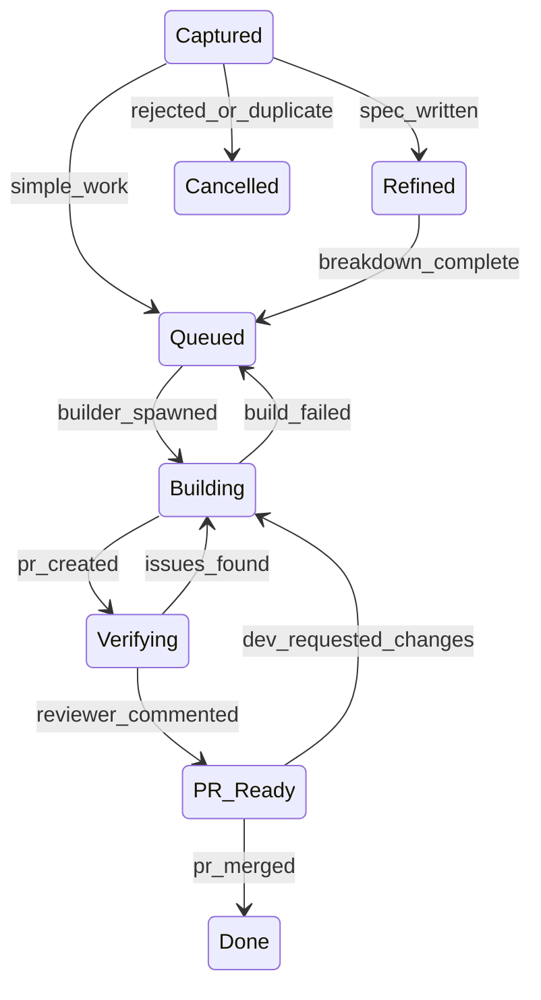

# VERSO Architecture

## Framework Architecture

### The VERSO Cycle

VERSO is a 5 macro-phase, 10 sub-phase development cycle:

| Phase | Letter | Sub-phases | Purpose |
|-------|--------|------------|---------|
| **V**alidate | V | Explore, Define | Ideation, feasibility, spec writing, acceptance criteria |
| **E**ngineer | E | Design, Plan, Build | Architecture, decomposition, implementation in worktree |
| **R**eview | R | Test, Verify | Automated checks, AI diff review against spec |
| **S**hip | S | Deliver, Launch | PR merge, changelog, version bump, release |
| **O**bserve | O | (continuous) | Metrics, retrospective, learnings fed back into prompts |

Each work item flows through the cycle. Shortcuts exist per work type (e.g., Hotfix skips Validate, Chore skips Validate and Review). The cycle is enforced by a state machine with explicit transitions.

### State Machine

The state machine has 8 states with guarded transitions:



Mapping to VERSO phases:

| Phase | States |
|-------|--------|
| Validate | Captured, Refined |
| Engineer | Queued, Building |
| Review | Verifying, PR Ready |
| Ship | Done (merged/released) |
| Observe | Periodic activity, not a board state |

### Transitions

Every transition has a **trigger**, a **guard**, and an **actor**:

| From | To | Trigger | Guard | Actor |
|------|----|---------|-------|-------|
| Captured | Refined | spec_written | dev_approved (if autonomy <= 2) | Pilot |
| Captured | Queued | simple_work | none | Pilot |
| Captured | Cancelled | rejected_or_duplicate | none | Pilot |
| Refined | Queued | breakdown_complete | dev_approved (if autonomy <= 2) | Pilot |
| Queued | Building | builder_spawned | wip_limit_ok | Pilot |
| Building | Verifying | pr_created | none | Builder |
| Building | Queued | build_failed | retries_remaining | Pilot |
| Verifying | PR Ready | reviewer_commented | none | Reviewer |
| Verifying | Building | issues_found | none | Reviewer - Pilot - Builder |
| PR Ready | Done | pr_merged | none | Developer (ONLY) |
| PR Ready | Building | dev_requested_changes | none | Developer - Pilot - Builder |

Key invariant: only `pr_merged` triggers the Done state. No agent ever closes issues manually.

Note on the Actor column: the Actor indicates whose action *triggers* the transition, not who updates the board. The Pilot is always the agent that executes board state changes.

### Roles

| Role | Actor | Responsibilities |
|------|-------|-----------------|
| **Captain** | Developer | Product decisions, approvals, merges |
| **Pilot** | AI Orchestrator | Intent classification, routing, state enforcement |
| **Crew: Builder** | AI Agent | Worktree setup, code, tests, PR creation |
| **Crew: Reviewer** | AI Agent | Diff analysis, spec validation, review comments |

Separation of concerns:
- The Pilot never writes code
- The Crew never makes product decisions
- The Captain retains final authority at every autonomy level

### Autonomy Dial

4 levels of progressive trust, configurable per work type:

| Level | Name | Developer Approves |
|-------|------|--------------------|
| 1 | **Full Control** | Spec, plan, every commit, PR |
| 2 | **Default** | Spec and PR |
| 3 | **PR Only** | Only PR |
| 4 | **Full Auto** | Just merges (or auto-merge with confidence threshold) |

The autonomy dial is configured per work type (feature, bug, hotfix, refactor, chore, enhancement) in `config.yaml`. Teams increase autonomy as trust builds.

### Scaling Model

VERSO adapts to team size:

| Scale | Captain | Pilot | Crew | Notes |
|-------|---------|-------|------|-------|
| **Solo** | 1 dev | 1 AI | 1 Builder + 1 Reviewer | Default setup |
| **Small team** | 2-5 devs | 1 AI | Shared crew | Multiple captains, one pilot |
| **Startup** | 5-15 devs | 1 AI per team | Dedicated crews | Team-level config |
| **Enterprise** | 15+ devs | Multiple pilots | Specialized crews | Org-level governance |

---

## OSS Template Structure

The `.verso/` directory is the single unit of adoption. Copying it into any repository enables VERSO:

```
.verso/
├── config.yaml          # Scale, autonomy, WIP, costs, CI, quality, deps, incidents
├── roadmap.yaml         # Vision, horizons (NOW/NEXT/LATER), goal-based milestones
├── state-machine.yaml   # States, transitions, guards, shortcuts per work type
├── releases.yaml        # Semver rules, changelog config
└── agents/
    ├── pilot.md         # Orchestrator: intent classification, routing, state enforcement
    ├── builder.md       # Implementation: worktree, code, tests, PR
    └── reviewer.md      # Review: diff analysis, spec validation, comment
```

### config.yaml Sections

| Section | Purpose |
|---------|---------|
| `scale` | Team size and role assignments |
| `autonomy` | Per-work-type autonomy levels (1-4) |
| `wip` | Work-in-progress limits to prevent review backlog |
| `board` | Issue board configuration (labels, columns, project) |
| `debt` | Technical debt tracking thresholds and policies |
| `costs` | Token/API cost budgets and alerts |
| `ci` | CI pipeline requirements (test commands, coverage thresholds) |
| `quality` | Code quality gates (linting, type checking, formatting) |
| `dependencies` | Dependency update policies and security scanning |
| `incidents` | Incident response workflows and escalation rules |

---

## Key Invariants

1. **No agent can skip states in the state machine.** Every work item must traverse the VERSO cycle. Shortcuts exist only as pre-configured paths per work type (e.g., Hotfix skips Validate, Chore skips Validate and Review), never as arbitrary state skips.

2. **Only `pr_merged` triggers the Done state.** GitHub auto-close via "Closes #N" in the PR body is the single mechanism. No agent ever closes issues manually.

3. **No agent ever closes issues manually.** This eliminates state inconsistencies between the board and the actual code state.

4. **The Pilot never writes code.** The Pilot classifies intent, routes work, and enforces state transitions. Implementation is exclusively the Builder's responsibility.

5. **The Crew never makes product decisions.** Spec approval, plan approval, and merge decisions belong to the Captain (or the Pilot at high autonomy levels, but never the Crew).

6. **WIP limits prevent review backlog.** The Builder cannot start new work if the review queue exceeds the configured WIP limit. This forces the cycle to complete before new work begins.
