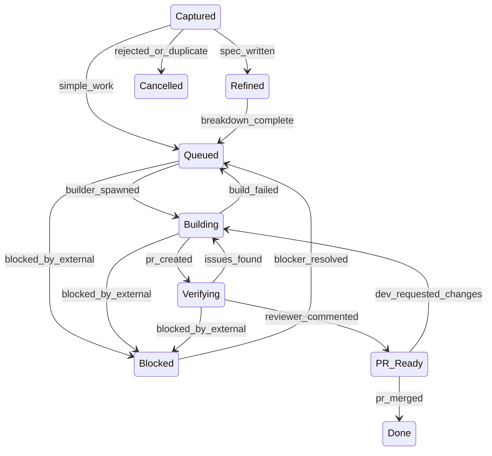

# VERSO Architecture

## Framework Architecture

### The VERSO Cycle

VERSO is a 5 macro-phase, 10 sub-phase development cycle:

| Phase | Letter | Sub-phases | Purpose |
|-------|--------|------------|---------|
| **V**alidate | V | Explore, Define | Ideation, feasibility, spec writing, acceptance criteria |
| **E**ngineer | E | Design, Plan, Build | Architecture, decomposition, implementation in worktree |
| **R**eview | R | Test, Verify | Automated checks, AI diff review against spec |
| **S**hip | S | Deliver, Launch | PR merge, changelog, version bump, release |
| **O**bserve | O | (continuous) | Metrics, retrospective, learnings fed back into prompts |

Each work item flows through the cycle. Shortcuts exist per work type (see table below). The cycle is enforced by a state machine with explicit transitions.

#### Shortcuts by Work Type

| Type | Path | Rationale |
|------|------|-----------|
| Feature | V-E-R-S-O | Full cycle, full rigor |
| Bug | V-E-R-S-O | Full cycle. Observe focuses on root cause analysis: was it preventable, and what process change would catch it earlier. |
| Hotfix | E-R-S | Skip V -- urgency overrides |
| Chore | E-S | Skip V and R -- low risk. CI serves as minimum quality gate in lieu of Review. |
| Refactor | V-E-R-S-O | V = scope approval |

### State Machine

The state machine has 9 states with guarded transitions:



Mapping to VERSO phases:

| Phase | States |
|-------|--------|
| Validate | Captured, Refined |
| Engineer | Queued, Building, Blocked |
| Review | Verifying, PR Ready |
| Ship | Done (merged/released) |
| Observe | Periodic activity, not a board state |

**Blocked**: A work item waiting on an external dependency or factor outside the team's control. The Captain identifies blockers and directs the Pilot to transition items to Blocked when progress cannot continue regardless of effort. When the blocker is resolved, the item returns to Queued for re-prioritization.

**Cancelled**: Cancelled is a terminal state. If a previously cancelled idea becomes relevant again, create a new work item and reference the original for context continuity. Re-validating with fresh context is preferable to resurrecting stale decisions.

### Transitions

Every transition has a **trigger**, a **guard**, and an **actor**:

| From | To | Trigger | Guard | Actor |
|------|----|---------|-------|-------|
| Captured | Refined | spec_written | dev_approved (if autonomy <= 2) | Pilot |
| Captured | Queued | simple_work | none | Pilot |
| Captured | Cancelled | rejected_or_duplicate | none | Pilot |
| Refined | Queued | breakdown_complete | dev_approved (if autonomy <= 2) | Pilot |
| Queued | Building | builder_spawned | wip_limit_ok | Pilot |
| Queued | Blocked | blocked_by_external | none | Captain |
| Building | Verifying | pr_created | ci_passes | Builder |
| Building | Queued | build_failed | retries_remaining | Pilot |
| Building | Blocked | blocked_by_external | none | Captain |
| Verifying | PR Ready | reviewer_commented | none | Reviewer |
| Verifying | Building | issues_found | none | Pilot |
| Verifying | Blocked | blocked_by_external | none | Captain |
| Blocked | Queued | blocker_resolved | none | Captain |
| PR Ready | Done | pr_merged | ci_passes | Developer (at autonomy levels 1-3) or auto-merge (at level 4) |
| PR Ready | Building | dev_requested_changes | none | Pilot |

> **Note on rework transitions:** For Verifying → Building, the Reviewer identifies issues but the Pilot triggers the state transition. For PR Ready → Building, the Developer requests changes but the Pilot executes the board transition. This preserves the single point of state management invariant.

Key invariant: only `pr_merged` triggers the Done state. No agent ever closes issues manually.

Note on the Actor column: the Actor indicates whose action *triggers* the transition, not who updates the board. The Pilot is always the agent that executes board state changes.

**Retry exhaustion:** When build retries are exhausted (default: 3 attempts), the Pilot transitions the item to Blocked with reason "max retries exceeded" and alerts the Captain.

### Roles

| Role | Actor | Responsibilities |
|------|-------|-----------------|
| **Captain** | Developer | Product decisions, approvals, merges. Does not write code -- delegates all implementation to Crew agents. |
| **Pilot** | AI Orchestrator | Intent classification, routing, state enforcement |
| **Crew: Builder** | AI Agent | Worktree setup, code, tests, PR creation |
| **Crew: Reviewer** | AI Agent | Diff analysis, spec validation, review comments |

Separation of concerns:
- The Pilot never writes code
- The Crew never makes product decisions
- The Captain retains final authority at every autonomy level

### Autonomy Dial

4 levels of progressive trust, configurable per work type:

| Level | Name | Developer Approves |
|-------|------|--------------------|
| 1 | **Full Control** | Spec, plan, every commit, PR |
| 2 | **Default** | Spec and PR |
| 3 | **PR Only** | Only PR |
| 4 | **Full Auto** | Nothing (auto-merge for configured types) |

The autonomy dial is configured per work type (feature, bug, hotfix, refactor, chore) in `config.yaml`. Teams increase autonomy as trust builds.

Default autonomy levels:

```yaml
autonomy:
  feature: 2       # approve spec + PR
  bug: 3           # approve only PR
  hotfix: 3        # fast-track, approve only PR
  refactor: 2      # approve scope + PR
  chore: 4         # auto -- just merge when ready
```

### Scaling Model

VERSO adapts to team size:

| Scale | Captain | Pilot | Crew |
|-------|---------|-------|------|
| **Solo** | 1 dev | 1 AI | 1 Builder + 1 Reviewer |
| **Small team** | 2-3 devs | 1 per dev | Shared pool |
| **Startup** | 5+ devs | 1 per dev | Per-team crews |
| **Enterprise** | 10+ devs | 1 per dev | Specialized crews |

### Non-Goals

- No ceremonies or standups
- No hiring/onboarding processes
- No infrastructure provisioning
- No non-software projects
- No replacement of human judgment
- No tool prescription -- the framework defines contracts, tool selection belongs to the Implementation Layer

### Supporting Systems

Cross-cutting concerns that interact with the VERSO cycle without being part of it:

| System | Phase Integration | Config Section |
|--------|------------------|----------------|
| CI/CD | Engineer → Ship (blocks Building → Verifying) | `ci` |
| Security scanning | Review (automated gates) | `quality` |
| Dependency management | Parallel (auto-PRs as Chore type) | `dependencies` |
| Incident response | External entry → Hotfix path (E-R-S) | `incidents` |
| Monitoring | Observe (feeds metrics) | `quality` |

### Automation Layer

VERSO separates durable decisions from disposable tooling through three layers.

| Layer | Scope | Stability | Ownership |
|-------|-------|-----------|-----------|
| **Philosophy** | Decision model, state machine, roles, autonomy dial | Stable across years | Framework core |
| **Contracts** | Required inputs, outputs, and invariants per phase | Stable across quarters | Framework core |
| **Implementation** | Specific tools, platforms, agents | Changes frequently | Community / user choice |

#### Phase Contracts

| Phase | Required Inputs | Required Outputs | Key Invariants |
|-------|----------------|-----------------|----------------|
| Validate | Raw idea, user feedback, or feature request | Spec with acceptance criteria, work type classification, shortcut path | No work starts without acceptance criteria. Ideas can die here. |
| Engineer | Approved spec with acceptance criteria | One isolated PR per work item (code + tests + docs) | Implementation happens in isolation (worktree/branch). Agent receives spec, not verbal instructions. |
| Review | Diff + original spec + acceptance criteria | Informational review comment with pass/fail assessment | Evaluates against spec, not subjective preferences. Never auto-approves. Never auto-merges (unless Autonomy Level 4 is configured for the work type). |
| Ship | Reviewed PR + passing CI (or CI alone for types skipping Review) | Merged code on main | A human merges by default. Autonomy Level 4 may enable auto-merge for explicitly configured work types. Single irreversible action in the cycle. CI is minimum quality gate when Review is skipped. |
| Observe | Production data, cycle metrics, cost data | Updated dashboard, retrospective notes, agent prompt improvements | Learnings feed back to Validate. Metrics include agentic-specific costs (tokens, API calls, dollars per work item). |

A tool is VERSO-compatible if it respects the contracts of the phase it operates in.

---

## OSS Template Structure

The `.verso/` directory is the single unit of adoption. Copying it into any repository enables VERSO:

```
.verso/
├── config.yaml          # Scale, autonomy, WIP, costs, CI, quality, deps, incidents
├── board.yaml           # Local board (work items)
├── roadmap.yaml         # Vision, horizons (NOW/NEXT/LATER), goal-based milestones
├── state-machine.yaml   # States, transitions, guards, shortcuts per work type
├── releases.yaml        # Semver rules, changelog config
├── agents/
│   ├── pilot.md         # Composed from core + role profile during init
│   ├── builder.md       # Implementation: worktree, code, tests, PR
│   └── reviewer.md      # Review: diff analysis, spec validation, comment
└── templates/
    ├── issue-feature.md # Template for feature issues
    ├── issue-bug.md     # Template for bug reports
    ├── issue-hotfix.md  # Template for hotfix issues
    ├── issue-chore.md   # Template for chore items
    ├── spec.md          # Specification template
    └── pr.md            # Pull request template
```

### config.yaml Sections

| Section | Purpose |
|---------|---------|
| `scale` | Team size and role assignments |
| `autonomy` | Per-work-type autonomy levels (1-4) |
| `wip` | Work-in-progress limits to prevent review backlog |
| `board` | Issue board configuration (labels, columns, project) |
| `debt` | Technical debt tracking (20% ratio threshold) |
| `costs` | Token and API cost budgets per work item |
| `ci` | CI pipeline requirements (test commands, coverage thresholds) |
| `quality` | Code quality gates (linting, type checking, formatting) |
| `dependencies` | Dependency update policies and security scanning |
| `incidents` | Incident response workflows and escalation rules |
| `releases` | Semver rules, changelog generation, tag format |

---

## Key Invariants

1. **No agent can skip states in the state machine.** Every work item must traverse the VERSO cycle. Shortcuts exist only as pre-configured paths per work type (e.g., Hotfix skips Validate, Chore skips Validate and Review), never as arbitrary state skips.

2. **Only `pr_merged` triggers the Done state.** GitHub auto-close via "Closes #N" in the PR body is the single mechanism. No agent ever closes issues manually.

3. **No agent ever closes issues manually.** This eliminates state inconsistencies between the board and the actual code state.

4. **The Pilot never writes code.** The Pilot classifies intent, routes work, and enforces state transitions. Implementation is exclusively the Builder's responsibility.

5. **The Crew never makes product decisions.** Spec approval, plan approval, and merge decisions belong to the Captain (or the Pilot at high autonomy levels, but never the Crew).

6. **WIP limits prevent review backlog.** Defaults: Building = 2 concurrent, PR Ready = 5 items. The Builder cannot start new work if the review queue exceeds the configured WIP limit. This forces the cycle to complete before new work begins.

7. **Blocked items must specify a reason.** The Pilot tracks blocked items and alerts the Captain when blockers are resolved.
