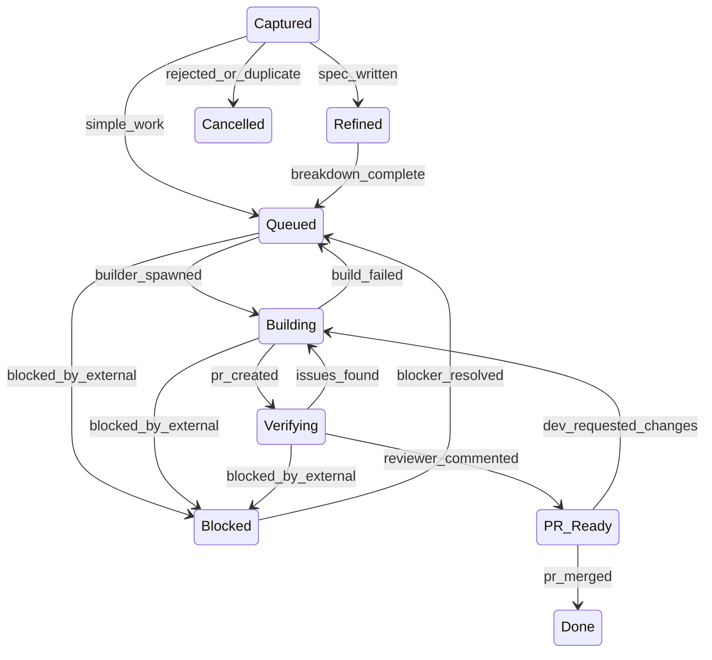
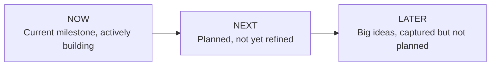

# VERSO

## A Development Framework for the Agentic Era

**Validate -- Engineer -- Review -- Ship -- Observe**

*The first development methodology designed for developers working with AI coding agents.*

> **Design Principle:** VERSO does not prescribe tools. It defines the decision model. Tools are ephemeral; the framework is durable. Any AI coding agent, any CI/CD platform, any code review tool can implement VERSO's phases and contracts.

---

## 1. The Problem

Every development methodology in wide use today was designed to solve one fundamental problem: **coordinating humans**.

Scrum invented standups so people could synchronize. Sprints exist so teams can commit to shared deadlines. Retrospectives exist because humans forget lessons. Story points exist because human output is variable and needs predicting. Kanban boards exist because humans lose track of what others are doing.

These are real problems. They deserve real solutions. And for teams of humans writing code by hand, these methodologies work.

But a solo developer working with AI coding agents has **none of these problems**. There is no one to synchronize with. There are no estimation games to play -- an agent either completes the task or it does not. There is no communication overhead -- the agent has perfect recall of every conversation. There is no context-switching penalty -- each agent carries its own context window.

What this developer has instead is a **new problem that no existing methodology addresses**: the bottleneck has moved from execution to decision-making.

An AI agent can write a feature in minutes. But it needs someone to tell it *what* to write, *approve* that the output is correct, and *decide* what comes next. If the developer is busy making trivial decisions the AI could handle autonomously, the entire system stalls. If the developer is absent, work stops completely -- not because there is nothing to do, but because no one is authorized to decide.

Traditional methodologies assume:

- **Multiple humans coordinating** -- a solo dev has no coordination problem
- **Humans doing the work** -- AI agents do the work
- **Communication is expensive** -- AI has perfect memory and infinite patience
- **Context switching has cost** -- each agent session is isolated by design

None of these assumptions hold. Applying coordination-era methodologies to agentic development is a mismatch -- not because those methodologies are bad, but because they solve a different problem. Scrum optimizes for human synchronization. VERSO optimizes for decision throughput. What we need is a framework designed from scratch for the world we actually live in.

---

## 2. The Paradigm Shift

VERSO is built on a single core thesis: **optimize for decision throughput**.

Decision throughput means: maximize correct decisions per hour of developer time, and minimize unnecessary decisions entirely. Every minute the developer spends on a decision an AI could have made is a minute the system is underperforming. Every decision the AI makes that should have been the developer's is a risk.

Three principles govern VERSO:

### The developer is brain, not hands

The developer decides WHAT to build and WHEN to ship. Never HOW to implement it. The moment you catch yourself typing code that an agent could write, you are misallocating your most scarce resource -- your judgment.

### Trust is progressive

Not every decision needs human approval. A trivial config change does not deserve the same scrutiny as a database migration. VERSO makes trust configurable: the more predictable the outcome, the less intervention required. Trust starts low and grows as the system proves itself.

### The board is the engine

In traditional workflows, the project board is a passive tracker -- a mirror of reality that someone has to manually update. In VERSO, the board IS the reality. It is a formal state machine that governs what can happen next, who can trigger it, and what guards must pass. No agent can skip a state. No work item can regress without a reason. The board does not reflect the process -- it *is* the process.

The developer becomes two things: a **Product Brain** (deciding what matters) and a **Quality Gate** (deciding what ships). Everything else -- research, implementation, testing, code review, documentation -- is delegated to AI agents operating under the board's authority.

---

## 3. Non-Goals

VERSO is deliberate about what it does not attempt to solve:

- **Team standup coordination.** VERSO has no ceremonies. The board is the communication layer.
- **Hiring or onboarding processes.** The framework assumes a developer and their agents are ready to work.
- **Infrastructure provisioning.** VERSO orchestrates the development lifecycle, not the deployment pipeline.
- **Non-software projects.** The state machine and phase contracts assume code as the primary output.
- **Replacing human judgment.** Even at Autonomy Level 4, a human configured the trust level. VERSO automates execution, not decisions.
- **Prescribing specific tools.** The framework defines contracts. Tool selection belongs to the Implementation Layer.

If your problem is not "how do I make correct decisions faster with AI agents," VERSO is probably not the right framework.

---

## 4. The VERSO Cycle

Five macro-phases. Continuous flow. No sprints.

### V -- Validate

*"Does this idea deserve to exist?"*

This is the creative fuzzy front end. The developer and AI act as partners: brainstorming, researching, checking feasibility, detecting duplicates.

- **EXPLORE**: Ideation, competitive analysis, technical feasibility
- **DEFINE**: Spec writing, acceptance criteria, scope boundaries

Ideas can die here -- and that is the system working correctly. A killed idea costs nothing. A built-and-discarded feature costs everything.

**Output**: Either nothing (idea rejected) or a captured work item with enough context for an agent to build it.

#### What constitutes a valid spec

The spec is VERSO's most critical artifact. It is the input to every downstream phase. A valid spec contains:

- **Problem statement:** What problem does this solve, and for whom?
- **Acceptance criteria:** Testable assertions that define "done." Not descriptions -- assertions. ("User can log in with email and password" not "implement login functionality.")
- **Scope boundaries:** What is explicitly out of scope for this work item.
- **Work type:** Feature, Bug, Hotfix, or Chore -- determines the shortcut path.

A spec may optionally include:
- Technical constraints (must use existing auth library, must not add new dependencies)
- UI/UX references (mockups, wireframes, existing patterns to follow)
- Related items (links to previous work, dependencies)

The spec does not need to include implementation details. That is the Engineer phase's job. A spec that prescribes implementation is micromanaging the agent.

### E -- Engineer

*"Build the solution."*

- **DESIGN**: UX/UI wireframes, technical architecture decisions
- **PLAN**: Decomposition into sub-tasks, dependency mapping
- **BUILD**: AI Builder agents implement in isolated worktrees, writing tests alongside code

One feature branch. One PR per work item. Sub-tasks are commits, not separate reviewable units.

### R -- Review

*"Is this good enough to ship?"*

- **TEST**: Automated checks -- type checking, unit tests, linting, integration tests
- **VERIFY**: AI Reviewer agent reads the diff against the original spec

The Reviewer writes an informational comment on the PR. Not a formal GitHub approval -- that mechanism was designed for human teams and adds friction for solo developers. The human makes the final judgment.

### S -- Ship

*"Deliver it."*

- **DELIVER**: The developer merges the PR. This is the only action that completes a work item as Done. No agent ever closes issues manually -- `pr_merged` is the sole trigger.
- **LAUNCH**: Release tagging, changelog generation (automated from PR descriptions), documentation updates

### O -- Observe

*"What did we learn?"*

- Metrics collection: throughput, cycle time, first-pass rate, cost per feature
- Automated retrospective at milestone completion
- Learnings fed back into agent prompts -- the Builder and Reviewer get smarter over time
- User feedback flows into the next Validate cycle

The cycle is continuous. Work flows through V-E-R-S-O without batching or sprints. Observe feeds directly back into Validate.

### Shortcuts by Work Type

Not everything needs the full cycle:

| Type | Path | Rationale |
|------|------|-----------|
| Feature | V - E - R - S - O | Full cycle, full rigor |
| Bug | V - E - R - S - O | Full cycle. Observe focuses on root cause analysis: was it preventable, and what process change would catch it earlier. |
| Hotfix | E - R - S | Skip V -- urgency overrides |
| Chore | E - S | Skip V and R -- low risk. CI serves as minimum quality gate in lieu of Review. |
| Refactor | V - E - R - S - O | V = scope approval |

---

## 5. Supporting Systems

The VERSO cycle defines the primary flow. But real projects have concerns that cut across phases, processes that run in parallel, and events that enter the system from outside. These supporting systems interact with the cycle without being part of it.

### 5.1 Cross-cutting Concerns

These are quality dimensions that span multiple VERSO phases. They are not separate phases -- they are embedded into the existing cycle as gates, checklist items, and configuration.

**CI/CD Integration**

CI/CD is not a phase -- it is the infrastructure that enforces transitions. In VERSO, the CI pipeline is a transition guard: the state machine cannot move from Building to Verifying unless CI passes. The Builder agent is responsible for ensuring the pipeline is green before creating a PR. The Reviewer agent validates that all checks pass before writing its review comment.

Configuration in `.verso/config.yaml`:

```yaml
ci:
  required_checks:
    - typecheck
    - tests
    - lint
  block_transition: true    # Building → Verifying requires all checks green
```

**Security**

Security is a Review-phase gate. The Reviewer agent's checklist includes: dependency vulnerability scanning, secrets detection, OWASP basics (injection, XSS, auth issues). At startup scale and above, security becomes a formal gate with dedicated tooling. At solo dev scale, it is a checklist item the Reviewer evaluates.

**Accessibility**

Accessibility follows the same pattern as security: a checklist item in Review at solo dev scale, a formal gate at enterprise scale. The Reviewer checks: keyboard navigation, semantic HTML, ARIA attributes, color contrast. Configuration determines whether accessibility issues block the transition or are flagged as warnings.

**Testing Strategy**

Testing is split across two phases. The Builder writes tests during Engineer (unit tests, integration tests alongside implementation). The Reviewer validates test coverage and quality during Review. Minimum coverage thresholds can be configured:

```yaml
quality:
  security_gate: warn        # warn | block
  accessibility_gate: warn   # warn | block
  min_coverage: 80           # minimum test coverage percentage
  require_tests: true        # Builder must include tests
```

### 5.2 Parallel Processes

These processes run continuously alongside the VERSO cycle. They are not triggered by work items -- they generate work items.

**Monitoring and Analytics (Post-Ship)**

After Ship, the Observe phase includes monitoring whether shipped features actually work in production. Analytics data (error rates, performance metrics, user behavior) feeds back into the Validate phase. If a shipped feature causes errors, the monitoring system auto-captures a bug work item in Captured state.

This closes the loop: Ship → Observe → monitoring detects issue → new work item in Validate → cycle continues.

**Dependency Management**

Dependencies are a continuous background process. Tools like Dependabot or Renovate auto-generate PRs for dependency updates. In VERSO, these enter the board as Chore-type work items with autonomy level 4 (auto) by default. If CI passes, the Pilot can auto-merge without developer intervention. If CI fails, the item escalates to the developer.

```yaml
dependencies:
  auto_capture: true         # auto-create work items from dependency alerts
  default_type: chore
  default_autonomy: 4        # auto-merge if CI passes
  security_patches: hotfix   # security updates treated as hotfixes
```

**Feature Flags**

Feature flags enable partial releases -- shipping code that is not yet active for all users. In VERSO, feature flags are an Engineer-phase decision: the Pilot determines whether a work item requires a flag based on risk, size, or the developer's preference. The Builder implements the flag. Ship activates the flag for a percentage of users. Observe monitors the rollout. Full activation is a separate Chore-type work item.

### 5.3 External Entry Points

Not all work originates from the developer saying "I want to build X." Some work enters the system from external sources. VERSO defines how each source maps to the board.

**User Feedback**

Users report bugs, request features, and provide feedback through various channels (support tickets, GitHub issues, social media, app reviews). The Pilot classifies incoming feedback:

- Bug report → work item in Captured, type Bug
- Feature request → work item in Captured, type Feature (evaluated during Validate)
- Noise / duplicate → Cancelled

At solo dev scale, the developer forwards feedback to the Pilot conversationally. At team scale, integrations (Intercom, Zendesk, GitHub Issues) can auto-capture directly into the board.

**Incident Response**

When production goes down, speed matters more than process. Hotfixes follow the shortcut path defined in Section 3 (E - R - S). The Pilot auto-captures the incident as a Hotfix work item and fast-tracks it into Engineer.

Incident severity can override autonomy settings:

```yaml
incidents:
  severity_override: true
  critical:
    autonomy: 3              # skip spec approval, approve only PR
    wip_override: true        # ignore WIP limits for critical incidents
  major:
    autonomy: 3
    wip_override: false
```

**Automated Alerts**

Dependency vulnerabilities, certificate expirations, infrastructure alerts, and scheduled maintenance all generate work items automatically. These enter the board as the appropriate type (Chore, Bug, or Hotfix depending on severity) and follow their respective shortcuts through the VERSO cycle.

---

## 6. The Automation Layer

VERSO operates at the philosophy level. It defines decisions, not implementations. But philosophy needs a bridge to reality.

The Automation Layer is that bridge. It defines three distinct layers that separate what is durable from what is disposable.

### 6.1 Three Layers

```
┌─────────────────────────────────────────────┐
│           Philosophy Layer                   │
│  Decision model, state machine, roles,       │
│  autonomy dial, shortcuts by work type       │
│  → Agnostic, stable, durable                │
├─────────────────────────────────────────────┤
│           Contracts Layer                    │
│  What each phase requires as input,          │
│  what it must produce as output,             │
│  what invariants it must preserve            │
│  → Defines WHAT, not HOW or WITH WHAT       │
├─────────────────────────────────────────────┤
│        Implementation Layer                  │
│  Specific tools, platforms, agents           │
│  → Changes every quarter. Out of scope.     │
└─────────────────────────────────────────────┘
```

The Philosophy Layer is this paper. The Contracts Layer is defined below. The Implementation Layer is deliberately excluded -- it belongs to the community, to blog posts, to recipes, not to the framework.

### 6.2 Phase Contracts

Each VERSO phase defines a contract: required inputs, expected outputs, and invariants that must hold.

| Phase | Inputs | Outputs | Invariants |
|-------|--------|---------|------------|
| **Validate** | Raw idea, user feedback, or feature request | Spec with acceptance criteria, work type classification, shortcut path | No work begins without acceptance criteria. Ideas can die here. |
| **Engineer** | Approved spec with acceptance criteria | One PR per work item with code, tests, and docs | Implementation happens in isolation (worktree/branch). The agent receives the spec, not verbal instructions. |
| **Review** | PR diff + original spec + acceptance criteria | Informational review comment with pass/fail assessment | The reviewer evaluates against the spec, not against subjective preferences. Never auto-approves. Never auto-merges (unless Autonomy Level 4 is configured for the work type). |
| **Ship** | Reviewed PR with passing CI (or passing CI alone for work types that skip Review) | Merged code on main branch | A human merges by default. Autonomy Level 4 may enable auto-merge for explicitly configured work types. This is the single irreversible action in the cycle. For work types that skip Review (e.g., Chores), CI serves as the minimum quality gate. |
| **Observe** | Production data, cycle metrics, cost data | Updated metrics dashboard, retrospective notes, agent prompt improvements | Learnings feed back into Validate. Metrics include agentic-specific costs (tokens, API calls, dollars per work item). |

### 6.3 Contract Compliance

A tool is VERSO-compatible if it respects the contracts of the phase it operates in. The framework does not care which tool fulfills the contract.

Examples of contract compliance:

- **Review phase:** CodeRabbit, Greptile, a custom LLM script, or a human reviewer -- any of these is valid as long as they receive the spec + diff and produce an informational comment without auto-merging (unless Autonomy Level 4 is configured for the work type).
- **Observe phase:** LinearB, a GitHub Action that posts weekly metrics, or a spreadsheet -- any of these is valid as long as they track the defined metrics and feed learnings back to Validate.
- **Engineer phase:** Claude Code, Cursor, Copilot, Aider, or a junior developer -- any of these is valid as long as they receive a spec and produce an isolated PR.

The contract is the interface. The tool is the implementation. Implementations are swapped; contracts endure.

---

## 7. The State Machine

VERSO is governed by a formal finite state machine. This is what prevents the inconsistencies and dropped-ball failures that plague ad-hoc agentic workflows.

### States



Mapping to VERSO phases:

| Phase | States |
|-------|--------|
| Validate | Captured, Refined |
| Engineer | Queued, Building, Blocked |
| Review | Verifying, PR Ready |
| Ship | Done (merged/released) |
| Observe | Periodic activity, not a board state |

**Blocked**: A work item that is waiting on an external dependency or factor outside the team's control (e.g., a third-party API not yet available, a pending decision from a stakeholder, a dependency on another team's deliverable). The Captain moves items to Blocked when progress cannot continue regardless of effort. When the blocker is resolved, the item returns to Queued for re-prioritization.

**Cancelled**: Cancelled is a terminal state. Once a work item is cancelled, it cannot be reopened or transitioned to any other state. If a previously cancelled idea becomes relevant again, create a new work item and reference the original for context continuity. Re-validating with fresh context is preferable to resurrecting stale decisions.

### Transitions

Every transition has a **trigger**, a **guard**, and an **actor**:

| From | To | Trigger | Guard | Actor |
|------|----|---------|-------|-------|
| Captured | Refined | spec_written | dev_approved (if autonomy <= 2) | Pilot |
| Captured | Queued | simple_work | none | Pilot |
| Captured | Cancelled | rejected_or_duplicate | none | Pilot |
| Refined | Queued | breakdown_complete | dev_approved (if autonomy <= 2) | Pilot |
| Queued | Building | builder_spawned | wip_limit_ok | Pilot |
| Queued | Blocked | blocked_by_external | none | Captain |
| Building | Verifying | pr_created | ci_passes | Builder |
| Building | Queued | build_failed | retries_remaining | Pilot |
| Building | Blocked | blocked_by_external | none | Captain |
| Verifying | PR Ready | reviewer_commented | none | Reviewer |
| Verifying | Building | issues_found | none | Pilot |
| Verifying | Blocked | blocked_by_external | none | Captain |
| Blocked | Queued | blocker_resolved | none | Captain |
| PR Ready | Done | pr_merged | ci_passes | Developer (ONLY) |
| PR Ready | Building | dev_requested_changes | none | Pilot |

> **Note on rework transitions:** For Verifying → Building, the Reviewer identifies issues in its review comment, but the Pilot is the sole actor that triggers the state transition. For PR Ready → Building, the Developer requests changes, but the Pilot executes the board transition and re-assigns the Builder. This preserves the invariant that the Pilot is the single point of state management.

**The golden rule: no agent can skip states.** The Pilot enforces this. Only `pr_merged` triggers Done. No agent ever closes issues manually.

**Blocked items must specify a reason.** The Pilot tracks blocked items and alerts the Captain when blockers are resolved.

**Note on the Actor column:** The Actor indicates whose action *triggers* the transition, not who updates the board. The Pilot is always the agent that executes board state changes. When the Builder creates a PR (triggering `pr_created`), the Pilot observes this and moves the item from Building to Verifying. When the Reviewer posts a comment (triggering `reviewer_commented`), the Pilot reads the verdict and moves the item accordingly. This ensures a single point of state management and prevents race conditions.

### WIP Limits

- **Building**: configurable, default 2 concurrent items
- **PR Ready**: configurable, default 5 items awaiting merge

WIP limits prevent the system from producing more output than the developer can review. An agent that opens 20 PRs while the developer sleeps is not being productive -- it is creating a review backlog that degrades quality.

---

## 8. Roles

VERSO has exactly three roles. This is deliberate.

### The Captain (Developer)

The human. Sets direction, makes decisions, approves quality.

- Expresses intent in natural language
- Approves at quality gates (frequency configured via the Autonomy Dial)
- Merges PRs -- the only irreversible action in the system
- Does not write code. The framework assumes the developer delegates all implementation to Crew agents.

### The Pilot (AI Orchestrator)

The developer's conversational partner. The main AI session that runs continuously.

- Classifies developer intent automatically (no commands to remember)
- Routes work to the correct VERSO phase
- Manages the board state machine -- enforces transitions, guards, WIP limits
- Spawns and coordinates Builder and Reviewer agents
- Reports status proactively
- **Never writes code itself**

In the reference implementation, the Pilot loads a dedicated system prompt from `.verso/agents/pilot/` (e.g., `solo-dev.md` for solo developers, `tech-lead.md` for tech leads) defining routing rules, autonomy configuration, and state machine enforcement. A shared `core.md` file contains the common logic all Pilot variants use.

> **Note on prompt updates:** The Pilot maintains agent prompts and configuration as part of the Observe feedback loop. Prompt updates are operational configuration, not code. When Observe produces learnings, the Captain approves prompt changes and the Pilot applies them to `.verso/agents/` files.

### The Crew (AI Agents)

Ephemeral, specialized agents spawned by the Pilot:

**Builder Agent**: Receives an issue with spec and acceptance criteria. Produces a PR with code, tests, and documentation. Works in an isolated worktree. By convention, loads `.verso/agents/builder.md` as its prompt.

**Reviewer Agent**: Receives a PR and the original spec. Reads the entire diff, validates against acceptance criteria, runs automated checks. Writes an informational review comment. By convention, loads `.verso/agents/reviewer.md` as its prompt.

Two agent types. One orchestrator. The Pilot never writes code. The Crew never makes product decisions.

### The Zero-Command Interface

The developer does not memorize commands. They talk:

- *"I want users to export data as CSV"* -- Pilot classifies as Feature, starts Validate
- *"The login page crashes on Safari"* -- Pilot classifies as Bug, routes accordingly
- *"Production is down"* -- Pilot classifies as Hotfix, fast-tracks to Engineer
- *"What's the status?"* -- Pilot reads the board, reports
- *"Start the next thing"* -- Pilot picks highest priority Queued item, spawns Builder
- *"Ship it"* -- Pilot identifies PR Ready items

Intent classification happens in the Pilot's system prompt via routing rules, not a separate tool or model.

---

## 9. The Autonomy Dial

Not all decisions need human approval. The Autonomy Dial is a per-work-type configuration that controls how much trust the developer places in the AI:

```
◄─────────── Autonomy Dial ───────────►
 1              2              3              4
 Full Control   Default        PR Only        Full Auto
 (Most human    (Balanced)     (Trust the     (Minimal
  oversight)                    agent)         oversight)
```

| Level | Developer Approves |
|-------|-------------------|
| 1 | Spec, plan, every commit, PR |
| 2 | Spec and PR (DEFAULT) |
| 3 | Only PR |
| 4 | Nothing (auto-merge for configured types) |

Configuration is per work type:

```yaml
autonomy:
  feature: 2       # approve spec + PR
  bug: 3           # approve only PR
  hotfix: 3        # fast-track, approve only PR
  refactor: 2      # approve scope + PR
  chore: 4         # auto -- just merge when ready
```

### Trust builds over time

Start at level 2. Observe the results. Adjust:

- The Builder handles CSS tasks well -- raise `bug` autonomy to 3
- Specs are consistently accurate -- raise `feature` autonomy to 3
- The Reviewer catches real issues -- raise `chore` autonomy to 4

The Autonomy Dial creates a spectrum from paranoid oversight to full delegation. The developer adjusts based on comfort, project maturity, and risk tolerance. There is no correct setting -- only the setting that matches reality.

---

## 10. Milestones and Roadmap

### Why sprints fail for agentic development

- Time estimation is meaningless when an agent can do in 1 hour what took 1 week
- Sprint commitments assume stable velocity; AI velocity is unpredictable
- Sprint ceremonies are overhead for a solo developer

### Goal-based milestones

A milestone is a **statement that becomes true**:

```yaml
milestone:
  name: "MVP Core"
  goal: "A developer can have a productive coding session"
  criteria:
    - "Session lifecycle works end-to-end"
    - "Chat with Claude renders correctly"
    - "Terminal panel is functional"
    - "Core keyboard shortcuts work"
  exit_criteria:
    - "Zero critical bugs"
    - "TypeScript compiles clean"
```

The milestone completes when ALL criteria are met. Not when a date arrives.

### Three-horizon roadmap



No dates. No quarters. The developer always knows what is NOW, NEXT, and LATER.

### Milestone-driven releases

When a milestone completes:
- Version number calculated from rules (milestone = minor bump, hotfix = patch)
- Changelog auto-generated from merged PRs
- Git tag created, GitHub release published
- The Pilot proposes; the developer approves

The Pilot is milestone-aware at all times: it prioritizes work that closes milestone criteria, alerts when a milestone is achievable, and warns about scope creep.

---

## 11. Metrics and ROI

### What to measure

| Metric | Indicates | Improve By |
|--------|-----------|------------|
| Throughput | Items done per week | Raise autonomy, reduce WIP |
| Cycle time | Captured to Done | Find state machine bottlenecks |
| Gate time | Time at decision points | Raise autonomy, better context |
| First-pass rate | PRs merged without rework | Improve agent prompts |
| Debt ratio | Debt items / total | Maintain near 20% |
| Milestone velocity | Criteria met per week | Focus on milestone-closing work |
| Unplanned ratio | Hotfixes+bugs / total | Indicates codebase stability |

### Cost metrics -- unique to agentic development

This is where VERSO produces insights no traditional methodology can. Every work item carries measurable cost:

**Per work item:**
- API tokens consumed (input + output)
- API cost in dollars
- Number of agent sessions (builder + reviewer + retries)
- Agent wall time
- Developer gate time (time at decisions)
- Developer review time (time reviewing the PR)

**ROI calculation:**

For this example, we assume a milestone with 22 work items across features, bugs, and chores.

```
Example milestone report -- MVP Core (22 items):
Traditional baseline: $13,500 (180 dev-hours at $75/hr, ~1 month elapsed)

Optimistic case -- clean specs, mature codebase, capable agents:
  AI costs:        $18.30 (avg $0.83/item)
  Dev time:        9.5 hours (gate decisions + PR review)
  Total cost:      $730
  Reduction:       ~95%

Typical case -- some rework, debugging, longer reviews:
  AI costs:        $41 (avg $1.86/item, ~30% rework rate adds sessions)
  Dev time:        22 hours (debugging agent output + deeper PR reviews)
  Total cost:      $1,690
  Reduction:       ~60-70%

Conservative case -- significant rework, complex codebase:
  AI costs:        $68 (avg $3.09/item, ~50% rework rate, more retries)
  Dev time:        38 hours (substantial debugging + revision cycles)
  Total cost:      $2,918
  Reduction:       ~40-50%
```

Your actual results will depend on project complexity, codebase maturity, and AI agent capability. Start by measuring your current baseline, then track improvements over the first month.

### Tech debt as a first-class metric

VERSO recommends a **20% debt ratio** -- roughly 1 in 5 work items should address debt. The Pilot tracks this and suggests debt work when the ratio drops.

Agentic development introduces debt categories traditional methodologies do not recognize:

- **Agent-generated debt**: shortcuts the AI took that a human would not
- **Agent-generated opacity**: code that passes all tests but follows patterns, abstractions, or naming conventions that no team member chose or understands. Unlike human-written technical debt, agent-generated opacity can accumulate silently because the code technically works
- **Intentional debt**: shipped for the milestone, scheduled for later
- **Drift**: dependencies outdating, patterns diverging across the codebase

### Learning feedback loop

After each milestone, the Pilot auto-generates a retrospective:
- Statistics (throughput, cycle time, first-pass rate, total cost)
- Patterns (what caused rework, what shipped cleanly)
- Suggested improvements (prompt changes, autonomy adjustments, checklist updates)

Learnings are incorporated into Builder and Reviewer prompts. The system gets smarter with every cycle.

---

## 12. Scaling

VERSO was designed for solo developers but scales without changing its core. The state machine stays the same. What changes is roles, permissions, documentation requirements, and ceremony level.

### The same state machine, different permissions

```
                  SOLO DEV     SMALL TEAM     STARTUP       ENTERPRISE
Roles              1 (all)      2-3            5+            10+
Pilot instances    1            per dev        per dev       per dev
Board              local        shared/synced  per team      hierarchy
Code review        AI only      AI + human     human + AI    formal process
QA                 checklist    basic plan     QA role       QA team
Docs required      minimal      moderate       comprehensive full suite
Autonomy default   2-3          2              1-2           1
```

The Pilot maintains a 1:1 ratio with developers at every scale. This is by design -- each developer's intent stream requires a dedicated orchestrator.

### Role permissions by scale

| Phase | Solo Dev | Team Dev | Tech Lead | PM/PO |
|-------|----------|----------|-----------|-------|
| Validate | full | receives work | full | full |
| Engineer | full | full | -- | -- |
| Review | full (AI) | full (human + AI) | full | -- |
| Ship | full | -- | full | -- |
| Observe | full | -- | full | full |

Team roles map to VERSO roles. The framework has exactly three roles -- Captain, Pilot, and Crew. At larger scales, multiple people share the Captain role with different permissions:

| Team Role | VERSO Role | Permissions |
|-----------|-----------|-------------|
| Solo Dev | Captain (full) | All decisions: spec, review, merge |
| Team Dev | Captain (scoped) | Spec and review within assigned areas |
| Tech Lead | Captain (elevated) | Merge authority, architecture decisions |
| PM/PO | Captain (validate) | Validate phase only: prioritization, spec approval |
| AI Orchestrator | Pilot | State management, routing (unchanged at any scale) |
| Builder Agent | Crew: Builder | Implementation (unchanged at any scale) |
| Reviewer Agent | Crew: Reviewer | Code review (unchanged at any scale) |

The Pilot and Crew roles remain identical regardless of team size. Only the Captain role splits into specialized variants.

### Team workflow

In a team, each developer has their own Pilot with role-appropriate permissions:

- **PM/PO's Pilot**: Validate phase -- capture ideas, write PRDs, prioritize the backlog
- **Tech Lead's Pilot**: Validate + Engineer planning -- architecture, breakdown, assignment
- **Team Dev's Pilot**: Engineer + Review -- build assigned tasks, create PRs
- **QA's Pilot**: Review phase -- testing, verification, sign-off

In the reference implementation, each role loads a different prompt from `.verso/agents/pilot/` (e.g., `team-dev.md`, `tech-lead.md`, `pm.md`), all sharing `core.md` for common logic. Same state machine, different access levels.

### Documentation expectations by scale

| Document | Solo Dev | Small Team | Startup | Enterprise |
|----------|----------|------------|---------|------------|
| Vision | 1 page | 1 page | 2-3 pages | Full document |
| Roadmap | Simple yaml | Shared yaml | With OKRs | Multi-team |
| PRD | No (spec in issue) | Big features | Always | Formal template |
| Design doc | Optional | Expected | Required + flows | + User research |
| ADRs | Light | Yes | Yes | Formal process |
| Test plan | Checklist | Checklist | QA plan | Full strategy |
| Launch plan | Post online | Checklist | Full plan | GTM strategy |

### The bus factor trade-off

VERSO at solo scale has a bus factor of one. If the Captain is unavailable, the system stops. This is the same problem the framework criticizes in traditional methodologies, and it is worth acknowledging.

At solo scale, this is acceptable -- a solo developer's project stops when they stop regardless of methodology. The mitigation is the board itself: because the state machine is explicit and every work item has a spec, a replacement Captain can pick up where the previous one left off with minimal context loss.

At team scale, the bus factor improves naturally. Multiple developers share the Captain role with different permissions. The Pilot and Crew agents are stateless by design -- they can be restarted by any authorized Captain. The critical artifact is not the developer's knowledge but the `.verso/` configuration and the board state.

---

## 13. Getting Started

### For solo developers

VERSO is designed for incremental adoption. You do not need everything on day one.

#### Step 1: Add the .verso directory

Scaffold the starter files into your project using the CLI:

```bash
npx @useverso/cli init
```

This gives your project:

```
your-project/
  .verso/
    config.yaml             # Autonomy levels, WIP limits, scale
    board.yaml              # Local board (work items)
    roadmap.yaml            # Milestones and horizons
    state-machine.yaml      # Transition rules (see note below)
    releases.yaml           # Versioning and release rules
    agents/
      pilot/
        core.md             # Shared Pilot logic
        solo-dev.md         # Solo developer Pilot prompt
        team-dev.md         # Team developer Pilot prompt
        tech-lead.md        # Tech lead Pilot prompt
        pm.md               # PM/PO Pilot prompt
      builder.md            # Builder agent instructions
      reviewer.md           # Reviewer agent instructions
    templates/
      issue-feature.md      # Template for feature issues
      issue-bug.md          # Template for bug reports
      issue-hotfix.md       # Template for hotfix issues
      issue-chore.md        # Template for chore items
      spec.md               # Specification template
      pr.md                 # Pull request template
```

**Note on `state-machine.yaml`:** The default state machine is designed to cover all standard workflows. Modifying it is an advanced operation that may break framework invariants. Most teams should use the default.

The `.verso/` directory includes a `version` field in `config.yaml` that tracks the VERSO framework version used to generate it. When upgrading VERSO, run `verso migrate` to update configuration files to the latest schema. Breaking changes between versions are documented in the framework changelog.

#### Step 2: Set up your board

The local board (`.verso/board.yaml`) is ready to use out of the box -- no external service required. Your work items live in version control, right next to your code.

If you prefer an external provider, configure it in `config.yaml`:

```yaml
board:
  provider: local              # local | github | linear
```

The `local` provider is the default. GitHub Projects and Linear are optional sync targets -- you can push your local board to them at any time via `verso sync`. All VERSO examples work identically regardless of which provider you choose.

When using an external board provider (GitHub Projects, Linear), the external provider is the source of truth for item state. The `.verso/` configuration defines the rules; the board provider holds the live state. The Pilot reads from and writes to the configured provider. If state conflicts arise between providers, the board provider wins. Running multiple board providers simultaneously is not supported -- pick one per project.

#### Step 3: Start working

Open your AI coding assistant. Load the Pilot prompt. Start talking.

*"I want to add user authentication."*

The Pilot takes it from there.

### For teams

1. Set your scale in `config.yaml`: `solo`, `small-team`, `startup`, or `enterprise`
2. Create role-specific Pilot prompts in `.verso/agents/pilot/`
3. Each team member loads their role's prompt
4. Set up a shared board -- use `provider: github` or `provider: linear` in `config.yaml`, then run `verso sync` to keep local and remote boards in sync
5. Work flows through V-E-R-S-O with role-appropriate gates

### The VERSO ecosystem

- **[Framework](https://github.com/useverso/verso)**: The specification and documentation. Free forever. Framework-agnostic, tool-agnostic.
- **[CLI](https://github.com/useverso/cli)**: Scaffolds the `.verso/` directory into your project, manages board sync, and more. Includes all starter templates. Works with Claude Code, Cursor, Copilot, or any AI coding tool.

---

*VERSO is not a process to follow. It is a machine to run. Configure it, start it, and let it do what machines do best -- execute relentlessly while you do what humans do best -- decide wisely.*

---

<p align="center">
  Crafted with ❤️ by <a href="https://boudydegeer.com">Boudy de Geer</a>
</p>

<p align="center">
  <a href="https://linkedin.com/in/boudydegeer">LinkedIn</a> · <a href="https://x.com/boudydegeer">X/Twitter</a>
</p>
